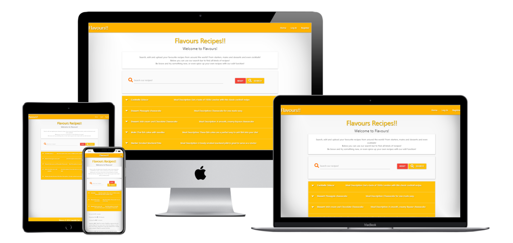

 <h1>Milestone Project</h1>

My site can be viewed at https://python-milestone.herokuapp.com/ 

This project will be used to display all that I have learned so far. I will be using this project to build a website for food lovers to come and save their recipes. Other users
will be able to view these as well as add, edit and delete their own recipes, should they choose to sign up. I want the website to be easily accessible, simple to navigate and user freindly. 
It must also be displayed for various devices (desktop ,Tablet, Mobile Phone) whilst maintaining a great user experience . Links within the website directing me to other pages either within this website
or to other social media accounts (Facebook, Twitter, Instagram). 

<h3>UX</h3>

<h4>User Stories</h4>

New users

<li>I want the user to easily understand the main purpose of the site and view recipes</li>
<li>I want the user to be able to easily navigate throughout the site to find content.</li>
<li>I want the user to be intrigued enough to register an account</li>
<li>I want the user to be able to see our contact details without registering an account</li>

Returning users

<li>I want the user to be able to log in easily</li>
<li>I want the user to be able to submit their own recipes</li>
<li>I want the user to be able to edit and delete their recipes</li>
<li>I want the user to be able to search for their recipes</li>
<li>I want the user to be able to view others recipes</li>
   
<h3> Design </h3>

<h4>Colour Scheme</h4>

I have used an amber and white theme. I have used this as it is bright and attractive. The theme is consistent throughout the site which is good for the UI/UX. The header and footers 
are both amber with white text and icons.The background is white, with black text.  
fit the colour theme.

<h4>Icons </h4>

I have incorporated icons from Font Awesome, thes have a functional purpose of highlighting certain input fields for the user.

<h4>Defensive Design</h4>

<li>To submit and edit recipe form, the category has to be chosen</li>
<li>The servings, preparation time, cook time and total time has to be numbered.</li>
<li>A recipe or category can't be deleted by just one click.</li>
<li>If someone clicks on the delete button, there wil be a modal with a confirmation if someone is sure to delete the recipe or category.</li>
<li>Defensive programming has been included to ensure users must be logged in, in order to edit or submit a recipe. If they are not they will be sent to the log in page.</li>
<li>The user must select a recipe category or they will not be able to progress further</li>

<h4>Wireframe</h4>

The final version whilst similar doesnt match exactly. My wireframes can be found in my wireframes folder.

<h4>Features</h4>

<li>The links in the footer, contact and resume pages all take you to the pages described, in new tabs.</li>
<li>Site is responsive to different device sizes.</li>
<li>Flavours logo is found in the top left of all pages, this will take the user to the home page.</li>
<li>The links are located to the right of the page, these will colapse into a navigation tab one smaller devices.</li>
<li>The navigation links and buttons show a slight shadowing to let the user know that they are above a clickable button.</li>
<li>Flash messages appear to let the user know what they have done for example a successful recipe submission.</li>
<li>The footer is designed to remain at the bottom of the page no matter how much information is on the page.</li>
<li>Once the user is signed in they have full functionality of the site. Non registered users can only see the Log In, Contact Us, Home and Register tabs.</li>
<li>The user can click on the social media links and be taken directly to the wedbiste on a new tab</li>
<li>The submit and edit recipe pages have fully functioning forms with defensive programming</li>

<h3>Features left to implement</h3>

I would like to add a number of features going forward such as:  
<li>Create a link that allows the user to submit an email</li>
<li>Allow the users to submit images</li>
<li>Allow users to comment on each others recipes</li>

<h3>Languages Used</h3>

<li>CSS</li> 
<li>HTML</li>
<li>jQuery</li>
<li>Python</li>

<h3>Technologies Used </h3>

I have built my site using: 

[<h4>CSS</h4>](https://en.wikipedia.org/wiki/CSS) 
I have used CSS to style my website

[<h4>HTML</h4>](https://en.wikipedia.org/wiki/HTML) 
I have used HTML as the main language to create my website.

[<h4>Materialize</h4>](https://materializecss.com/)
I have used this for the responsive layout as well as custom components such as header, images, icons,footer, cards, and collapse element.

[<h4>Balsamiq</h4>](https://balsamiq.com/#)
I used Balsamiq to help create my template and design a quality site 

[<h4>Jinja</h4>](https://jinja.palletsprojects.com/en/3.0.x/)
I have used Jinja for my Python template

[<h4>GitHub</h4>](https://github.com/)
I have used Github as the hosting site for my code.

[<h4>Werkzeug</h4>](https://pypi.org/project/Werkzeug/)
I used Werkzeugfor password hashing and authentication

[<h4>Flask</h4>](https://pypi.org/project/Flask/)
I have used Flask for the web application framework

[<h4>MongoDB</h4>](https://www.mongodb.com/)

[<h4>Heroku</h4>](https://www.heroku.com/)
I have used Heroku to deploy my app 

[<h4>MongoDB</h4>](https://www.mongodb.com/)
I have used MongoDB as the database service for my project

<h4>Git</h4>
Git is used as version control software to commit and push code to the GitHub repository where the source code is stored.

[<h4>Techsini</h4>](http://techsini.com/multi-mockup/index.php)
I have used this to create a mock up of the site on different devices

<h3>Features left to implement</h3>

I would like to add a number of features going forward such as:  
<li>Link the Collaboration form to an external mailbox</li>
<li>Add a download Resume button/link</li>
<li>An online store selling packages for development ideas/pricing plans</li>

 
<h3>Testing</h3> 

I have tested my site thoroughly, all the links are working and take the user to the correct pages. 
The webpage will respond when used on smaller devices, the nav bar will shrink down into a drop down menu. 

<li>I placed my site throught a CSS Validator which returned no errors</li>
<li>I have placed all pages through a HTML Validator which returned one warning</li>  
<li>I have tested my webpage using [Google Mobile Testing](https://search.google.com/test/mobile-friendly) This returned no errors</li>
<li>I have tested the Javascript on my webpage, this returned two warnings, no errors.</li>

<h3>Test User Stories</h3>

<h4>New Users</h4>

I want to easily understand the main purpose of the site and learn a variety of meal recipes.
Upon entering the site, users will see the website name in the top left corner, Flavours!, followed by a variety of links in the top right.
Below that there is a text section detailing what the site is about and its aims. This should have enough information to get me to register an account.
I want to be able to easily navigate throughout the site to find content.
The header will contain links to the other pages, this will be a responsive menu that will collapse on a mobile device. 
The footer will contain copyright logo and the website name again.
I can use the Contact page to find out how to find out further social media links.

<h4>Returning Users</h4>
 
I can find the log in section quite easily both with the log in button in the nav bar but also the link on the register page.
Submitting a recipe is very easy with all text fields clearly labelled and formatted to only allow the relevant text.
The search function works very well, if I want a recipe containing chicken for example all chicken recipes will appear 
All other recipes will be listed on the home page.
 

<h3>Deployment</h3>
I used Heroku for the deployment of my app. To set up the local workspace for Heroku in the terminal window of GitPod I typed: pip3 freeze -- local > requirements.txt followed by python app.py > Procfile 
I then needed to create a Heroku account and create a new app and select my region.
The deployment method was 'Github'
Click on the Connect to GitHub section in the deploy tab in Heroku.
Search your repository to connect with it.
When your repository appears click on connect to connect your repository with the Heroku.
Go to the settings app in Heroku and go to Config Vars. Click on Reveal Config Vars.
Enter the variables contained in your env.py file. These should be: IP, PORT, SECRET_KEY, MONGO_URI, MONGO_DBNAME
Push the requirements.txt and Procfile to repository.
$ git add requirements.txt
$ git commit -m "Add requirements.txt"
$ git add Procfile
$ git commit -m "Add Procfile"
Automatic deployment: Go to the deploy tab in Heroku and find Automatic deployments. Click on Enable Automatic Deploys. By Manual deploy click on Deploy Branch.
Heroku will receive my code from Github and host the app using the required packages. Click on Open app in the right corner of your Heroku account. The app wil open and the live link is available from the address bar.

<h3>Credits</h3>
The task manager mini project was my initial inspiration for my project, I then tailored this to a recipe site after viewing the https://www.bbc.co.uk/food/recipes website
My hero image was taken from https://www.pexels.com/search/food/

<h3>Acknowledgements</h3> 

I need to thank my mentor Spencer Barriball for helping me and providing the guidance I needed. I would not have made it this far on the course without his advice and support. Brilliant tutor/mentor. 
Tutor support was also a great help on occasion as well as Slack.